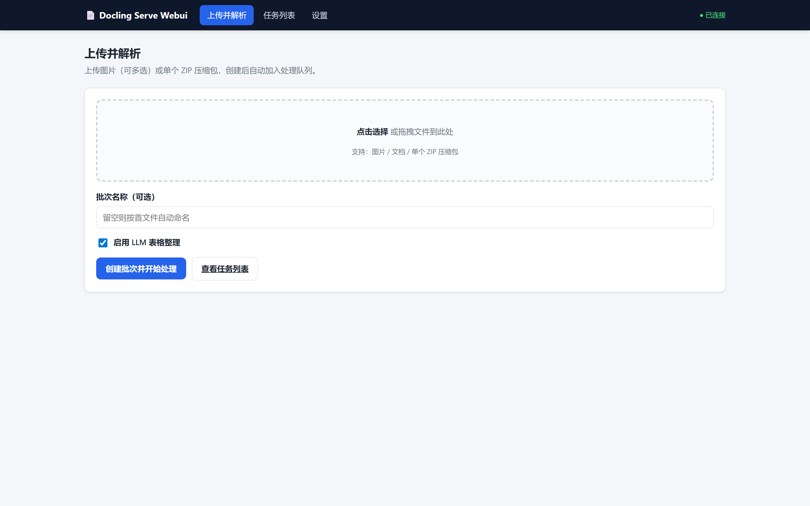
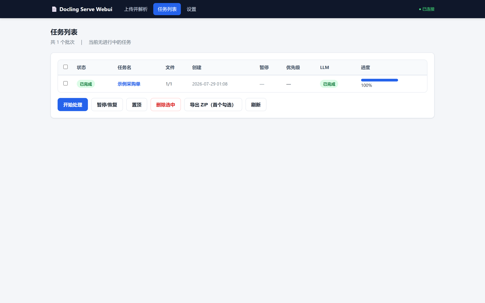
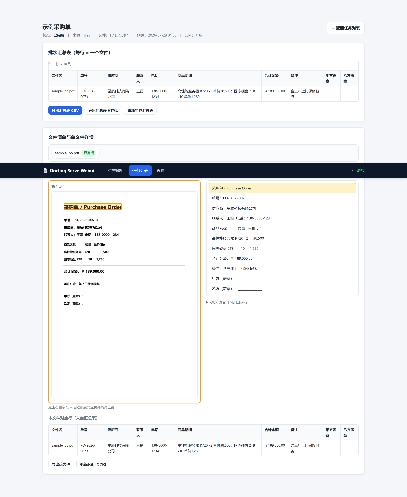
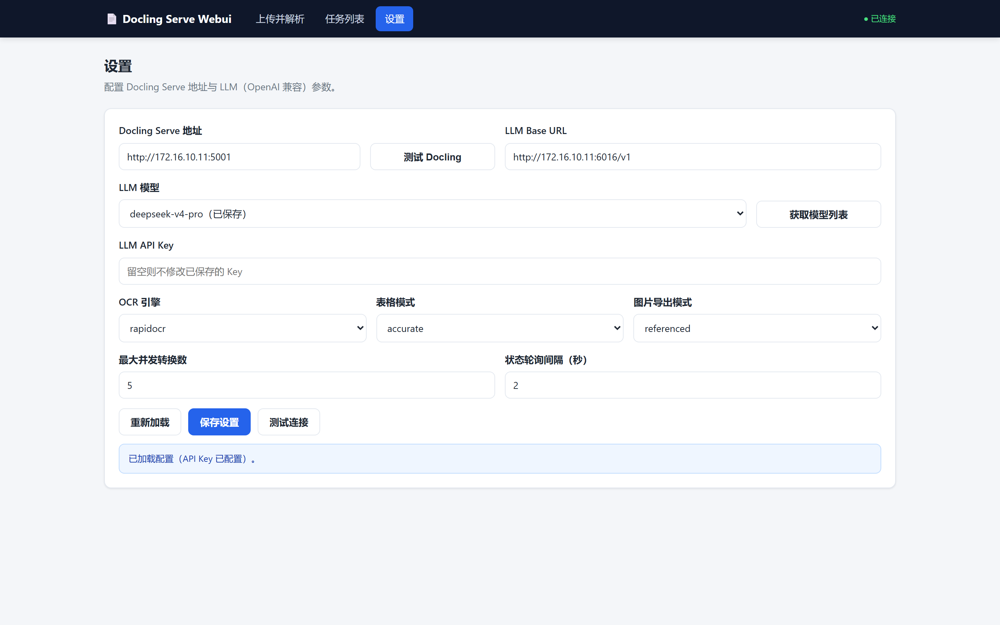

# Docling Serve WebUI

> 批量文档 OCR + AI 表格整理，浏览器里拖进去就能用。

把一堆图片（发票、合同、身份证、截图……）或者 PDF / Office 文档**拖进网页**，剩下的交给它：

1. **OCR 识别** —— 调 [Docling Serve](https://github.com/docling-project/docling-serve) 提取文字、表格、版面结构
2. **AI 汇总成表**（可选）—— 用 OpenAI 兼容的 LLM 把每个文件的信息整理成「一张表，每行一个文件」
3. **导出** —— CSV / 带缩略图的 HTML / ZIP，随你选

不用写代码，不用装前端构建工具，打开浏览器就能操作。

---

## 先看看长什么样

### 上传页面

拖文件进来，起个名字，勾不勾 LLM 都行，点一下就开始。



### 任务列表

所有批次一目了然：状态、进度条、处理了多少文件、LLM 有没有跑完。支持暂停、置顶、批量删除。



### 任务详情 —— 这是核心

点进某个批次后，你会看到：

- **顶部**：LLM 生成的汇总表（一张表看完所有文件的关键信息）
- **中间**：每个文件的原图 / PDF 原页预览，点击右侧的识别字段会在图上**高亮定位**（PDF 自动跳到对应页）
- **底部**：该文件在汇总表中的行对照



### 设置页

Docling Serve 地址、LLM 模型和 Key、OCR 引擎、表格模式……都在这里配。改完点保存即时生效，还有连接测试按钮。



---

## 它是怎么工作的

```
浏览器 ──→ WebUI (:8001) ──┬── Docling Serve (:5001)   ← OCR 引擎（必需）
                            └── LLM API (可选)           ← AI 整理表格
```

WebUI 本身**不含任何 OCR 模型**——它只是一个调度器 + 可视化界面。真正的识别工作全部交给 Docling Serve 完成。LLM 也是可选的，不配也能正常做 OCR。

前端是原生 HTML/CSS/JS，由 FastAPI 同一进程托管，不需要单独的前端构建步骤或 Node.js 环境。

---

## 快速开始

### 第一步：准备 Docling Serve（OCR 引擎）

WebUI 离不开它，必须先有一个能用的实例。两种方式任选：

#### A. pip 装在本机（适合快速体验）

```bash
python -m venv .venv && source .venv/bin/activate   # Windows: .venv\Scripts\activate
pip install "docling-serve[ui]"
docling-serve run
```

首次启动会自动下载模型权重，需要联网，等它出现 `Application startup complete` 就好了。之后访问 `http://localhost:5001/health` 返回 200 就说明就绪。

> 只有一个健康检查路径：`/health`。不是 `/v1/health`，也不是 `/`，记这个就行。

#### B. Docker 跑起来（推荐，省事）

```bash
# CPU 版本，开箱即用
docker run -p 5001:5001 quay.io/docling-project/docling-serve

# 有 NVIDIA GPU？用加速版
docker run --gpus all -p 5001:5001 quay.io/docling-project/docling-serve-cu128
```

### 第二步：启动 WebUI

```bash
git clone https://github.com/helwod/docling-webui.git
cd docling-webui/src

python -m venv .venv && source .venv/bin/activate   # Windows: .venv\Scripts\activate
pip install -r requirements.txt

cp .env.example .env        # 编辑 .env，填上 Docling 地址和 LLM Key（如果要用的话）
uvicorn app.main:app --host 0.0.0.0 --port 8001
```

打开浏览器访问 **http://localhost:8001** ，就是你在上面截图里看到的那个界面了。

`.env` 里最关键的就这几项：

| 配置 | 说明 | 示例 |
|------|------|------|
| `DOCLING_BASE_URL` | Docling Serve 地址（必填，填到端口即可） | `http://localhost:5001` |
| `LLM_BASE_URL` | LLM API 地址（可选） | `https://api.deepseek.com/v1` |
| `LLM_MODEL` | 模型名 | `deepseek-chat` |
| `LLM_API_KEY` | API Key | `sk-xxxxx` |

> 不想用 LLM？上传时取消勾选「启用 LLM 表格整理」就行，纯 OCR 功能完全不受影响。
> 设置页改的参数会写入数据库，优先级高于 `.env`——也就是说你可以在网页里直接改配置，不用重启服务。

---

## Docker 一键部署

项目自带 `docker-compose.yml`，一条命令同时拉起 WebUI 和 Docling Serve：

```bash
docker compose up -d
```

然后：
- WebUI → http://localhost:8001
- Docling Serve → http://localhost:5001

两个服务通过内部网络互通，WebUI 自动连上 Docling，不用手动填地址。

如果想只部署 WebUI（Docling Serve 已经在别处跑了）：

```bash
docker build -t docling-webui .
docker run -d -p 8001:8001 \
  -e DOCLING_BASE_URL=http://<你的docling地址>:5001 \
  -e LLM_API_KEY=sk-xxx \
  docling-webui
```

---

## 反向代理 / 子路径部署

前端所有资源引用和接口调用都已经是**相对路径**了，所以你可以把它挂在任意子路径下，比如 `https://your-site.com/docling/`。

**最简单的方式**——Nginx 剥离前缀，后端照常以根路径启动：

```nginx
location /docling/ {
    proxy_pass http://127.0.0.1:8001/;    # 注意结尾的 /
}
```

如果你的反代**不能**剥离前缀（`proxy_pass` 后面没有 `/`），那就告诉后端自己的前缀：

```bash
APP_ROOT_PATH=/docling uvicorn app.main:app --port 8001
```

两种方式效果一样，选你顺手的那种。

> 新增页面或 JS 时记得保持相对路径引用，别写 `/assets/...` 或 `/api/...` 这种绝对路径，否则子路径部署会断掉。

---

## 常见问题

**Docling 连不上 / OCR 一直转圈？**
先确认 `curl http://<你的docling地址>:5001/health` 返回 200。再检查 `.env` 或设置页里的地址是否填对（到端口为止，不要带 `/v1`）。设置页有「测试 Docling」按钮，点一下就知道通不通。

**LLM 汇总表生成失败？**
大部分情况是模型返回了流式(SSE)响应但客户端没正确解析。本程序已经做了兼容处理（`stream=True` + 累加 delta）。建议在设置页先用「测试连接」按钮验证通过；另外汇总表对模型的 JSON 输出能力有要求，尽量用支持 structured output 的模型。

**端口被占了？**
默认用 8001（8000 太容易被系统服务占）。换端口：`uvicorn app.main:app --port <新端口号>`。

**重启后正在处理的任务丢了？**
不会丢。后端启动时会自动把中断中的批次重置回队列，去任务列表重新点「开始处理」就能续跑。

**导出的 CSV 没有图片？**
CSV 本来就不带图片嘛。要带缩略图的直观版本，选「导出 HTML」格式。

**PDF 预览怎么实现的？**
后端用 PyMuPDF 把 PDF 每页渲染成 PNG 图片并缓存，前端按页展示。点击字段高亮时会自动跳到对应页并在原图上画框。第一次打开某 PDF 会稍慢（取决于页数），之后就走缓存了。

**Docling 启动好慢 / 吃资源？**
首次确实要下载模型权重。纯 CPU 能跑但偏慢，生产环境建议上 GPU 镜像（`-cu128` / `-cu130`），速度差距很大。

---

## 目录结构

```
src/                          # 应用主目录（后端 + 前端合在一起）
├── app/
│   ├── main.py               # 入口：API 路由 + 静态页面托管
│   ├── config.py             # 配置读取（.env）
│   ├── db/                   # SQLite 数据库
│   ├── routers/              # API：batches / files / config
│   ├── services/             # 核心业务：docling / llm / export / queue_scheduler
│   ├── repositories/         # 数据访问层
│   ├── models/               # 数据模型与 schema
│   └── utils/
├── index.html                # 首页：上传并解析
├── tasks.html                # 任务列表
├── task.html                 # 任务详情（PDF 预览 + 字段高亮 + 汇总表）
├── settings.html             # 设置页
├── assets/                   # CSS / JS（由 /assets 挂载）
├── data/                     # 数据库文件（gitignore）
├── uploads/                  # 上传文件（gitignore）
├── requirements.txt
├── .env.example
└── .env                      # 本地配置（不入库）
Dockerfile                    # WebUI 镜像
docker-compose.yml            # WebUI + Docling 一体编排
```

---

## 相关链接

- [Docling Serve 官方文档](https://docling-project.github.io/docling/usage/api_server/deployment)
- [Docling Serve GitHub](https://github.com/docling-project/docling-serve)
- [Docling 论文](https://arxiv.org/abs/2501.17887)
